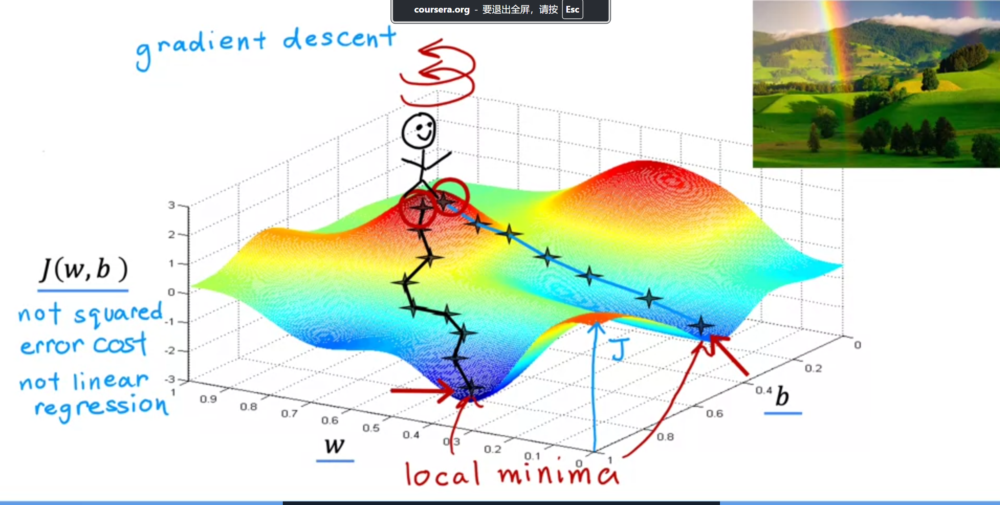

## Instructions

Welcome to the Machine Learning Specialization!

> - Specialization：专门化/专业化

You're joining millions of others who have taken either this or the original course, which led to the founding of Coursera,and has helped mullions of other learners, like you, take a look at the exciting world of machine learning!

> 你将加入数百万其他学习者，他们已经参加了这门课程或原始课程，这些课程导致了 Coursera 的成立，并帮助了数百万其他学习者，比如你，了解令人兴奋的机器学习世界！
>
> - taken: 参加
> - either: 任何一个
> - led to: 导致
> - founding: 成立
> - take a look at: 了解
> - exciting world: 令人兴奋的世界

## Learning Objectives

1. Define machine learning
2. Define supervised learning

   - 使用带有正确答案的数据来训练模型。

3. Define unsupervised learning

   - 使用没有正确答案的数据来训练模型

4. Write and run Python code in Jupyter Notebooks
5. Define a regression model

   - 它使用单一输入变量进行预测，也称为一元线性回归

6. implement and visualize a cost function
7. implement gradient descent
8. Optimize a regression model using gradient descent

## 1. Overview of Machine Learning 机器学习概述

### [1.1 Welcome to machine learning](./video/welcome-to-machine-learning/welcome-to-machine-learning_summary.md) 欢迎来到机器学习

1. 机器学习的应用广泛
2. 机器学习在工业和企业中的应用
3. 机器学习的定义和课程介绍
4. 课程的欢迎和启动

### [1.2 Application of machine learning](./video/applications-of-machine-learning/applications-of-machine-learning_summary.md) 机器学习的应用

1. 课程内容与实践
2. 机器学习算法的重要性
3. 实际应用技巧
4. 机器学习的广泛应用
5. 机器学习的必要性
6. 作者的工作经验
7. 机器学习的应用前景
8. 人工智能的终极目标
9. 机器学习的经济价值
10. 学习机器学习的重要性

## 2. Supervised vs. Unsupervised Machine Learning 监督学习与无监督学习

### [2.1 What is machine learning](./video/what-is-machine-learning/what-is-machine-learning_summary.md)

1. 机器学习的定义
2. 机器学习的历史和实例
3. 机器学习算法的实践
4. 机器学习的主要类型
5. 监督学习和无监督学习的重要性
6. 课程结构,实际应用建议,最佳实践,课程目标

### [2.2 Supervised learning part1](./video/supervised-learning-part-1/supervised-learning-part-1_summary.md)

1. 监督学习的经济价值
2. 监督学习的定义
3. 监督学习的应用实例
4. 监督学习的训练过程
5. 具体示例：房价预测
6. 监督学习的分类-> Classification and Regression

### [2.3 Supervised learning part2](./video/supervised-learning-part-2/supervised-learning-part-2_summary.md)

1. 监督学习算法
2. 回归算法
3. 分类算法
4. 分类问题示例：乳腺癌检测
5. 分类算法的特点
6. 分类算法的多样性
7. 分类算法的输出
8. 多输入值的监督学习
9. 学习算法的决策边界
10. 监督学习的总结

### [2.4 Unsupervised learning part1](./video/unsupervised-learning-part-1/unsupervised-learning-part-1_summary.md)

1. 无监督学习的重要性
2. 无监督学习与监督学习的区别
3. 无监督学习的目标-> 找到数据中的结构、模式或有趣的东西
4. 聚类算法
5. 聚类算法的实际应用
6. 无监督学习的多样性 -> 聚类、异常检测和降维

### [2.5 Unsupervised learning part2](./video/unsupervised-learning-part-2/unsupervised-learning-part-2_summary.md)

1. 无监督学习的定义和类型
2. 聚类算法
3. 异常检测
4. 降维
5. 无监督学习的应用实例
6. 无监督学习与监督学习的对比
7. Jupyter Notebooks 在机器学习中的应用

### [2.6 Jupyter Notebook](./video/jupyter-notebooks/jupyter-notebooks_summary.md)

### [Lab:Python And Jupyter Notebook](./lab/C1_W1_Lab01_Python_Jupyter_Soln.ipynb)

### [Quiz:Supervised vs unsupervised learning](./quiz.ipynb#W1-2)

## 3. Regression Model 回归模型

### [3.1 Linear regression model part1](./video/linear-regression-model-part-1/linear-regression-model-part-1_summary.md)

1. 线性回归模型是监督学习的一部分
2. 线性回归模型是最广泛使用的算法之一
3. 线性回归的概念适用于其他机器学习模型
4. 线性回归用于预测数值型数据
5. 线性回归是回归问题的一个例子
6. 监督学习模型分为回归模型和分类模型
7. 数据的可视化和数据表的使用
8. 机器学习中的标准符号和术语
9. 训练集的概念和重要性
10. 如何使用训练集进行预测

> - 线性回归模型是监督学习过程中的基础模型，是一条直线拟合数据集，实现预测。
> - 回归模型和分类模型的区别在于输出类型，回归模型输出连续值，分类模型输出离散值。
> - Training set 概念
> - x = input variable, y = output/target variable,m = number of training examples, i = index of training example

### [3.2 Linear regression model part1](./video/linear-regression-model-part-2/linear-regression-model-part-2_summary.md)

1. 监督学习的过程
2. 训练集的组成
3. 训练模型
4. 函数 f 的作用
5. 模型的表示 -> f_w,b(x) = w\*x + b
6. 线性回归模型
7. 线性回归的解释
8. 多变量线性回归
9. 预测值 = y-hat, 目标值 = y

### [Lab:Model_representation](./lab/C1_W1_Lab02_Model_Representation_Soln.ipynb)

没涉及 w,b 的动态更新，只是简单的模型表示

### [3.3 Cost function formula](./video/cost-function-formula/cost-function-formula_summary.md)

1. 成本函数的定义： $ J(w, b) = \frac{1}{2m} \sum*{i=1}^{m} (y*{\text{hat}, i} - y_i)^2 $
   m 是训练集的大小，y_hat 是预测值，y 是目标值
   为什么除以 2m：为了简化计算，不影响最终结果

在计算导数时： $$ \frac{\partial J(w, b)}{\partial w} = \frac{1}{m} \sum*{i=1}^{m} (y*{\text{hat}, i} - y_i) x_i $$ 这样，前面的 $\frac{1}{2}$ 被抵消掉，简化了导数的表达式。

2. 选择参数以拟合数据
3. 构建成本函数以衡量拟合度
4. 均方误差：有惩罚大误差的效果
5. 最小化平方误差等价于最大化似然估计

### [3.4 Visualizing the cost function](./video/visualizing-the-cost-function/visualizing-the-cost-function_summary.md)

1. 线性回归模型和成本函数
2. 可视化模型函数和成本函数

### [3.5 Visualization examples](./video/visualization-examples/visualization-examples_summary.md)

1. 不同参数对拟合线和成本函数的影响
2. 寻找最佳拟合线的重要性
3. 梯度下降算法的重要性

### [Lab:Cost function](./lab/C1_W1_Lab03_Cost_function_Soln.ipynb)

### [Quiz:Regression Model](./quiz.ipynb#W1-3)

# 4. Train the model with gradient descent

> 使用梯度下降训练模型

> - Train: 训练
> - gradient descent: 梯度下降

## [4.1 Gradient descent](./video/gradient-descent/gradient-descent_summary.md)

1. 梯度下降是一种系统性寻找最优参数的方法
2. 梯度下降在机器学习中的广泛应用: 线性回归、神经网络
3. 梯度下降是机器学习中的重要基石
4. 梯度下降适用于最小化任意函数
5. 梯度下降的目标是找到使代价函数最小的参数值:选择参数 w_1 到 w_n 和 b 的值，使得代价函数 j 的值最小
6. 梯度下降从初始猜测值开始迭代优化,初始参数的选择对结果影响不大通常是 0
7. 梯度下降可能存在多个局部最小值
8. 梯度下降的直观理解：下山算法

9. 梯度下降算法的工作原理 = 不断调整参数来减少成本函数的值直至找到成本函数的最小值
   

- [4.2 Implementing gradient descent](./video/implementing-gradient-descent/implementing-gradient-descent_summary.md)

1. 梯度下降算法的实现
2. 参数更新规则
3. 学习率 `Alpha`
4. 导数项的作用
5. 参数 `b` 的更新
6. 梯度下降的收敛
7. 同时更新参数
8. 正确的梯度下降实现
9. 非同时更新的问题
10. 导数和微积分

- [4.3 Gradient descent intuition](./video/gradient-descent-intuition/gradient-descent-intuition_summary.md)

1. 梯度下降算法的直观理解
2. 学习率（Alpha）的作用
3. 导数（Derivative）在梯度下降中的作用
4. 梯度下降参数更新的直观解释
5. 梯度下降在不同初始化点的行为
6. 导数的直观理解=是斜率 高度/宽度 向左倾斜为负数 向右倾斜为正数
7. 学习率（Alpha）的选择

- [4.4 Learning rate](./video/learning-rate/learning-rate_summary.md)

1. 学习率对梯度下降效率的影响:alpha 的选择对梯度下降的效率有巨大影响。如果学习率选择不当，梯度下降可能根本无法工作
2. 学习率过小/过大的影响
3. 梯度下降在局部最小值处的行为
4. 梯度下降的自适应步长

- [4.5 Gradient descent for linear regression](./video/gradient-descent-for-linear-regression/gradient-descent-for-linear-regression_summary.md)

1. 如何将线性回归模型与梯度下降算法结合
2. 梯度下降算法的导数计算
3. 导数公式的来源
4. 梯度下降算法的实现
5. 梯度下降的收敛性

- [4.6 Running gradient descent](./video/running-gradient-descent/running-gradient-descent_summary.md)

1. 梯度下降在线性回归中的应用
2. 梯度下降的初始化和更新
3. 梯度下降的全局最小值
4. 梯度下降的实际应用
5. 批量梯度下降
6. 其他梯度下降变体
7. 线性回归的进一步学习

- [Lab:Gradient descent](./lab/C1_W1_Lab04_Gradient_Descent_Soln.ipynb)
- [Quiz:Train the model with gradient descent](./quiz.ipynb#W1-4)
